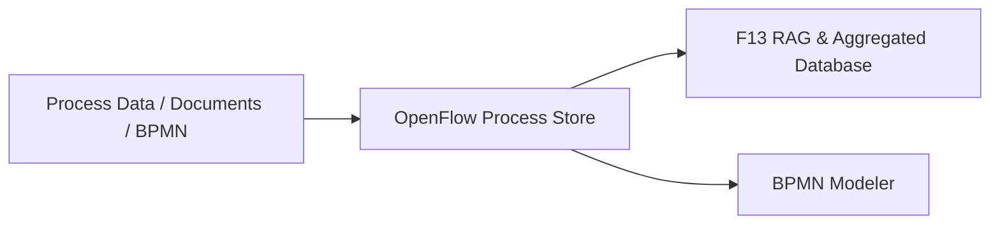
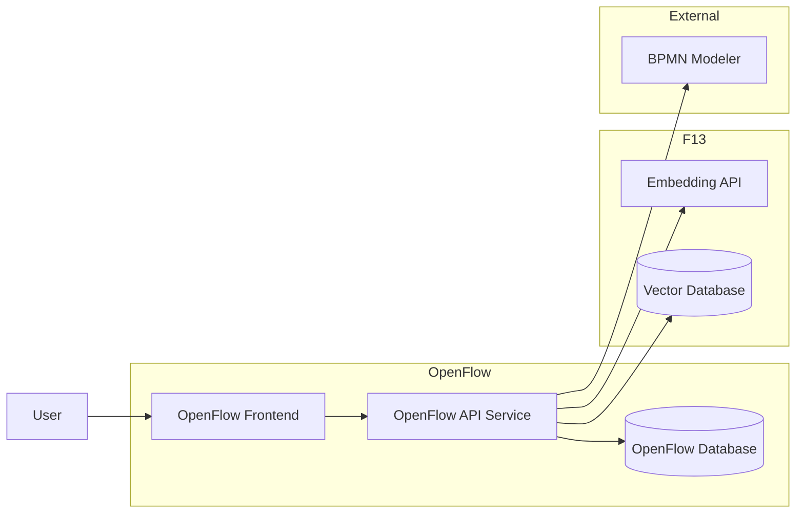
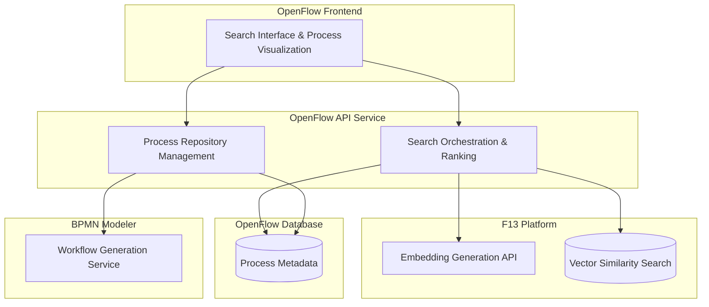
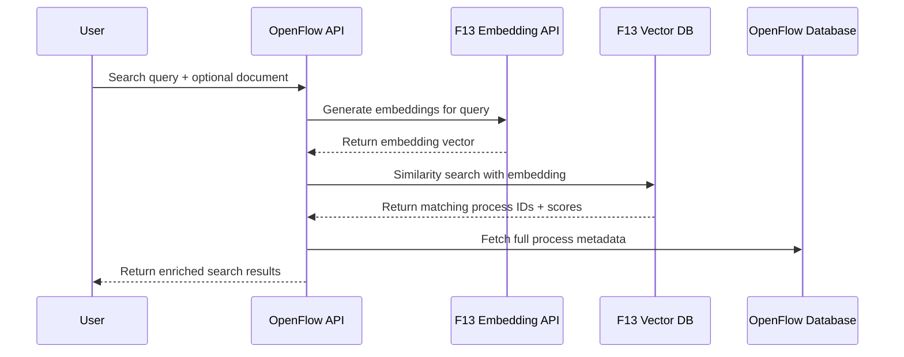

# OpenFlow

A beautiful AI-powered search for government process discovery with BPMN visualization capabilities.

> This Proof-of-Concept was built during the [GovTech Hackathon 2025](https://hackathon.govtech.saarland/) in Saarbrücken, Germany.


## Overview

The Saarland government's [F13 AI platform](https://f13-os.de/) provides a Retrieval-Augmented Generation (RAG) service with embedding generation and vector similarity search capabilities. **OpenFlow** leverages F13's AI capabilities while maintaining ownership of process data and search orchestration.

**Motivation**: 
- Stop silos re-implementing redundant processes in government departments
- Make it easy for administrative staff to find the right process
- Enable standardization and collaboration across departments

### F13 & OpenFlow Integration

Today: F13 is planned to provide the aggregated database for publicly available goverment data for use in applications and automation scenarios.

**This solution is based on the assumption that F13 will provide**:
- Embedding information for government processes and documents
- The aggregated (vector) database provides similarity search APIs
- BPMN generation capabilities are centrally available



### Demo

Query: "How do I procure software licenses over 25,000 EUR for our department? Do I need a tender process?

### Scope of this Solution

This solution, is a comprehensive government process discovery platform that uses F13's AI capabilities for embedding generation and vector search while maintaining complete ownership of process data, search logic, and user experience.

Core functionalities include:

- **Process Management**: Store and manage complete government process repository
- **Natural Language Search**: Users input queries and documents to find relevant processes  
- **AI-Powered Matching**: Generate embeddings via F13 and perform similarity search
- **Rich Metadata**: Provide process owners, contact info, forms, legal bases, and analytics

### Architecture

#### Context



#### Building Blocks



#### Search Flow Sequence



### Architecture Benefits

**OpenFlow Ownership**:
- Complete control over process data and business logic
- Integration with existing government systems
- Not depicted above but enabled:
  - Audit trails and compliance features
  - User personalization and department-specific customizations  
  - Analytics and usage tracking for government insights

**F13 Integration**:
- State-of-the-art embedding generation for semantic search
- High-performance vector similarity search
- Leverages government AI infrastructure
- No vendor lock-in for search algorithms

### TODOs

**Backend Development**:
- [ ] Implement OpenFlow API service (ASP.NET Core)
- [ ] Set up OpenFlow database schema (process metadata, users, analytics)
- [ ] Integrate F13 embedding API client
- [ ] Integrate F13 vector database for similarity search
- [ ] Implement BPMN modeler integration
- [ ] Build process management CRUD operations

**Search & Discovery**:
- [ ] Implement semantic search orchestration
- [ ] Add user context and personalization features
- [ ] Build process ranking and filtering logic
- [ ] Replace mock data with real F13 integration

**User Experience**:
- [ ] Authentication & Authorization (government SSO)
- [ ] Department-specific process filtering
- [ ] User preferences and bookmarking
- [ ] Search history and analytics dashboard

### Lessons Learned during GovTech Hackathon 2025
- Setup of F13 cumbersome based on open source documentation (ARM processor architecture, model cannot be loaded, etc.)
  - [ ] Bug reports created

## Tech Stack

**Frontend**:
- React 18 with TypeScript
- PrimeReact UI components
- RSPACK for fast bundling
- Prime React Icons
- bpmn-js for workflow visualization

**Backend** (To be implemented):
- ASP.NET Core with C#
- Entity Framework Core for database access
- Microsoft SemanticKernel for AI orchestration
- PostgreSQL with pgvector extension

**AI & Integration**:
- F13 Embedding API for semantic vector generation
- F13 Vector Database for similarity search
- BPMN Modeler API for workflow generation
- Government SSO integration

## Getting Started

### Prerequisites

- Node.js 24+ 
- npm or yarn

### Installation

1. Clone the repository:
```bash
git clone <repository-url> openflow
cd openflow
```

2. Install dependencies:
```bash
npm install
```

3. Start the development server:
```bash
npm run dev
```

4. Open your browser to `http://localhost:3000`

### Build for Production

```bash
npm run build
```

## Usage

1. **Search**: Enter natural language queries like:
   - "How is procurement over 10k EUR handled?"
   - "Show me the employee onboarding process"
   - "What happens after invoice approval?"

2. **Browse Results**: View matching processes sorted by relevance score

3. **Explore Details**: Click on any process to see:
   - BPMN workflow diagram
   - Contact information
   - Related documents
   - Legal basis and regulations
   - Key performance indicators
   - Supporting evidence snippets

## Project Structure

```
src/
├── components/          # React components
├── types/              # TypeScript definitions
├── theme/              # MUI theme configuration
├── App.tsx            # Main application
└── index.tsx          # Entry point
```

## Integration Architecture

**OpenFlow as Process Owner**:
- Maintains complete government process repository
- Handles user management, preferences, and analytics
- Orchestrates search across multiple AI services
- Integrates with existing government systems

**F13 AI Platform Integration**:
- **Embedding API**: Converts text queries and documents to vector representations
- **Vector Database**: Performs high-speed similarity search across process embeddings
- **Infrastructure**: Leverages government AI platform for secure, compliant processing

**BPMN Modeler Integration**:
- **Automated Generation**: Creates workflow diagrams when processes are updated
- **Version Control**: Maintains BPMN history and process evolution
- **Validation**: Ensures generated workflows comply with government standards

**Government Systems**:
- **Authentication**: Integration with government SSO (Active Directory)
- **Document Management**: Links to official forms and legal documents  
- **Audit & Compliance**: Full traceability for government oversight requirements

## License

MIT License