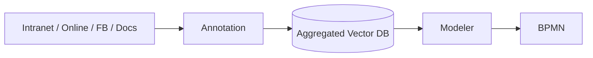

# OpenFlow

A beautiful RAG-powered dashboard for government process discovery with BPMN visualization capabilities.

## Overview

The Saarland government's F13 AI platform provides a Retrieval-Augmented Generation (RAG) service that enables embedding of process embedding in a vector space for usage in natural language processing (RAG). It is planned to increase the amount of information embedded into this system. 



This solution, named "OpenFlow", is an application that connects to the F13 service to allow users to search for and explore government processes using natural language queries to identify processes relevant to their department, resort and daily work.

## Features

- 🔍 **Natural Language Search**: Ask questions about government processes in plain language
- 📊 **Process Discovery**: Find matching government processes ranked by relevance scores
- 🌊 **BPMN Visualization**: Interactive workflow diagrams for each process
- 📞 **Contact Integration**: Direct access to process owners and responsible departments
- 📋 **Contextual Metadata**: Forms, legal bases, KPIs, and systems information
- 🌿 **Beautiful Design**: Modern grass-green themed interface with MUI components

## Tech Stack

- **Frontend**: React 18 with TypeScript
- **UI Framework**: Material-UI (MUI) v5
- **Build Tool**: RSPACK for fast bundling
- **Icons**: MUI Icons + Lucide React
- **BPMN**: bpmn-js for workflow visualization

## Getting Started

### Prerequisites

- Node.js 18+ 
- npm or yarn

### Installation

1. Clone the repository:
```bash
git clone <repository-url>
cd openflow-atlas-dashboard
```

2. Install dependencies:
```bash
npm install
```

3. Start the development server:
```bash
npm run dev
```

4. Open your browser to `http://localhost:3000`

### Build for Production

```bash
npm run build
```

## Usage

1. **Search**: Enter natural language queries like:
   - "How is procurement over 10k EUR handled?"
   - "Show me the employee onboarding process"
   - "What happens after invoice approval?"

2. **Browse Results**: View matching processes sorted by relevance score

3. **Explore Details**: Click on any process to see:
   - BPMN workflow diagram
   - Contact information
   - Required forms and documents
   - Legal basis and regulations
   - Key performance indicators
   - Supporting evidence snippets

## Project Structure

```
src/
├── components/          # React components
├── types/              # TypeScript definitions
├── theme/              # MUI theme configuration
├── App.tsx            # Main application
└── index.tsx          # Entry point
```

## Integration Notes

This frontend is designed to integrate with:
- **F13 Government AI Platform** for RAG-powered search
- **BPMN Generation Service** for workflow diagrams
- **Process Repository API** for business process metadata

## License

Government Open Source License - See LICENSE file for details.