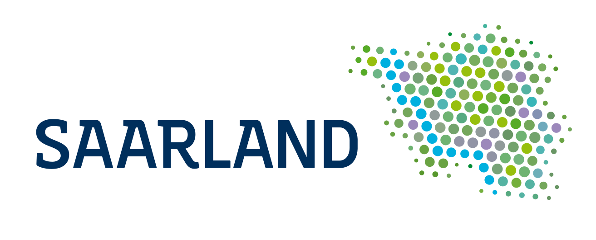

# OpenFlow

A beautiful AI-powered search for government process discovery with BPMN visualization capabilities.

> This Proof-of-Concept was built during the [GovTech Hackathon 2025](https://hackathon.govtech.saarland/) in Saarbrücken, Germany.




## Overview

The Saarland government's [F13 AI platform](https://f13-os.de/) provides a Retrieval-Augmented Generation (RAG) service with embedding generation and vector similarity search capabilities. **OpenFlow** leverages F13's AI capabilities while maintaining ownership of process data and search orchestration.

**Motivation**: 
- Stop silos re-implementing redundant processes in government departments
- Make it easy for administrative staff to find the right process
- Enable standardization and collaboration across departments

### F13 & OpenFlow Integration

Today: F13 is planned to provide the aggregated database for publicly available goverment data for use in applications and automation scenarios.

**This solution is based on the assumption that F13 will provide**:
- Embedding information for government processes and documents
- The aggregated (vector) database provides similarity search APIs
- BPMN generation capabilities are centrally available


### Demo


**Demo Persona: Sarah, New Employee**
Sarah joins the IT department and needs to procure a software license for 26,999 EUR. Unsure about the process and requirements, she uses **OpenFlow** and simply asks:

_"How do I procure software licenses over 25,000 EUR for our department? Do I need a tender process?"_


OpenFlow instantly provides:
- Matching processes ranked by relevance (score and adoption count)
- The step-by-step procurement workflow (visualized)
- Contact info for the responsible office
- Related documents and legal bases
- Evidence why this process fits her query

Sarah quickly understands what to do, who to contact, and which forms to use—no jargon or manual searching required.


**What does the demo show?**
- Natural language search for government processes
- AI-powered matching via F13 embedding and vector search
- Rich process metadata (owner, contact, forms, legal basis)
- Interactive BPMN workflow visualization
- Evidence snippets for transparency

**Goal**

Showcase the potential of combining F13's AI capabilities with a dedicated process discovery platform to make government work more accessible and efficient for everyone—from seasoned administrators to new employees like Sarah.

### Scope of this Solution

This solution, is a comprehensive government process discovery platform that uses F13's AI capabilities for embedding generation and vector search while maintaining complete ownership of process data, search logic, and user experience.

Core functionalities include:

- **Process Management**: Store and manage complete government process repository
- **Natural Language Search**: Users input queries and documents to find relevant processes  
- **AI-Powered Matching**: Generate embeddings via F13 and perform similarity search
- **Rich Metadata**: Provide process owners, contact info, forms, legal bases, and analytics

### Architecture

#### Context


#### Building Blocks


#### Search Flow Sequence

*Note: User and intranet are omitted for clarity.*


### Architecture Benefits

**OpenFlow Ownership**:
- Complete control over process data and business logic
- Integration with existing government systems
- Not depicted above but enabled:
  - Audit trails and compliance features
  - User personalization and department-specific customizations  
  - Analytics and usage tracking for government insights

**F13 Integration**:
- State-of-the-art embedding generation for semantic search
- High-performance vector similarity search
- Leverages government AI infrastructure
- No vendor lock-in for search algorithms

**Intranet Organigram Service Integration**:
- **Centralized organizational data**: Single source of truth for government structure
- **Real-time hierarchy**: Always up-to-date department and personnel information
- **User context enrichment**: Provides organizational context for personalization
- **Contact information**: Authoritative contact details for process owners

**OpenFlow User Service**:
- **Organizational data abstraction**: Wraps Intranet Organigram API
- **User profile management**: Combines org data with user preferences
- **Department filtering**: Enables department-specific process recommendations
- **Contact enrichment**: Adds hierarchical context to process owners

### TODOs

**Backend Development**:
- [ ] Implement OpenFlow API service (ASP.NET Core)
- [ ] Set up OpenFlow database schema (process metadata, users, analytics)
- [ ] Integrate F13 embedding API client
- [ ] Integrate F13 vector database for similarity search
- [ ] Implement BPMN modeler integration
- [ ] Build process management CRUD operations
- [ ] Implement User Service for Intranet Organigram integration
- [ ] Build organizational hierarchy caching layer

**Search & Discovery**:
- [ ] Implement semantic search orchestration
- [ ] Add user context and personalization features
- [ ] Build process ranking and filtering logic
- [ ] Replace mock data with real F13 integration

**User Experience**:
- [ ] Authentication & Authorization (government SSO)
- [ ] Department-specific process filtering
- [ ] User preferences and bookmarking
- [ ] Search history and analytics dashboard

### Lessons Learned during GovTech Hackathon 2025
- Setup of F13 cumbersome based on open source documentation (ARM processor architecture, model cannot be loaded, etc.)
  - [ ] Bug reports created

## Tech Stack

**Frontend**:
- React 18 with TypeScript
- PrimeReact UI components
- RSPACK for fast bundling
- PrimeIcons
- bpmn-js for workflow visualization

**Backend** (To be implemented):
- ASP.NET Core with C#
- Entity Framework Core for database access
- Microsoft SemanticKernel for AI orchestration
- PostgreSQL with pgvector extension

**AI & Integration**:
- F13 Embedding API for semantic vector generation
- F13 Vector Database for similarity search
- BPMN Modeler API for workflow generation
- Government SSO integration

## Getting Started

### Prerequisites

- Node.js 24+ 
- npm or yarn

### Installation

1. Clone the repository:
```bash
git clone <repository-url> openflow
cd openflow/src/frontend
```

2. Install dependencies:
```bash
npm install
```

3. Start the development server:
```bash
npm run dev
```

4. Open your browser to `http://localhost:3000`

### Build for Production

```bash
npm run build
```

## Usage

1. **Search**: Enter natural language queries like:
   - "How is procurement over 10k EUR handled?"
   - "Show me the employee onboarding process"
   - "What happens after invoice approval?"

2. **Browse Results**: View matching processes sorted by relevance score

3. **Explore Details**: Click on any process to see:
   - BPMN workflow diagram
   - Contact information
   - Related documents
   - Legal basis and regulations
   - Key performance indicators
   - Supporting evidence snippets

## Project Structure

```
src/frontend/
├── src/
│   ├── components/          # React components
│   │   ├── chat/           # Search input and file upload
│   │   ├── details/        # Process details components
│   │   └── list/           # Process list components
│   ├── types/              # TypeScript definitions
│   ├── theme/              # PrimeReact theme configuration
│   ├── data/               # Mock data for development
│   ├── utils/              # Utility functions
│   ├── App.tsx             # Main application
│   └── index.tsx           # Entry point
├── public/                  # Static assets
├── package.json
├── tsconfig.json
└── rspack.config.js
```

## Integration Architecture

**OpenFlow as Process Owner**:
- Maintains complete government process repository
- Handles user management, preferences, and analytics
- Orchestrates search across multiple AI services
- Integrates with existing government systems

**F13 AI Platform Integration**:
- **RAG Database Endpoint**: Performs semantic search with automatic embedding generation and vector similarity
- **Document Ingestion**: Indexes process documents into F13's vector database (Elasticsearch)
- **Metadata Filtering**: Supports filtering by source, date range, and custom metadata fields
- **Infrastructure**: Leverages government AI platform for secure, compliant processing
- **No Direct Embedding API**: Embeddings are generated internally within RAG workflows

**BPMN Management** (Separate from F13):
- **Pre-generated Diagrams**: BPMN XML stored in OpenFlow database or file system
- **Manual Creation**: Process diagrams created using BPMN modeling tools
- **Future Enhancement**: Potential LLM-based generation using F13's chat capabilities
- **Visualization**: Frontend renders BPMN using bpmn-js library

**Intranet Organigram Service** (External Government System):
- **Centralized Master Data**: Single source of truth for organizational structure
- **API Endpoints**:
  - `GET /api/v1/departments/{id}` - Get department details
  - `GET /api/v1/departments/{id}/hierarchy` - Get full organizational path
  - `GET /api/v1/employees/{id}` - Get employee and contact information
  - `GET /api/v1/search/departments?query={term}` - Search departments
- **Data Model**: Department ID, name, parent department, contact persons, email, phone
- **Update Frequency**: Real-time synchronization with HR systems
- **Access Control**: OAuth 2.0 with government SSO integration

**OpenFlow User Service** (Internal Component):
- **Purpose**: Abstracts and caches Intranet Organigram data
- **Responsibilities**:
  - Fetch and cache organizational hierarchy
  - Resolve department IDs to full hierarchical paths
  - Enrich process owners with current contact information
  - Provide user department context for personalized search
- **Caching Strategy**: 
  - Department structure cached for 24 hours
  - Contact information cached for 1 hour
  - Invalidation on explicit update signals
- **API Endpoints**:
  - `GET /api/v1/users/{userId}/context` - Get user's org context
  - `GET /api/v1/organizations/hierarchy/{departmentId}` - Get cached hierarchy
  - `GET /api/v1/contacts/{processId}` - Get enriched contact info for process

**Government Systems**:
- **Authentication**: Integration with government SSO (Active Directory)
- **Document Management**: Links to official forms and legal documents  
- **Audit & Compliance**: Full traceability for government oversight requirements

## License

MIT License