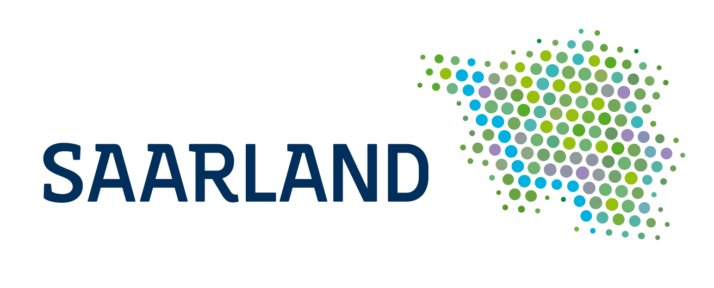
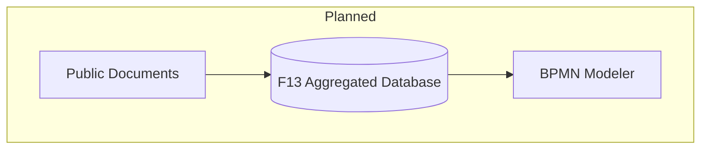
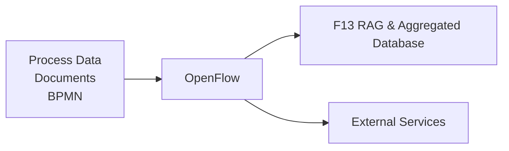
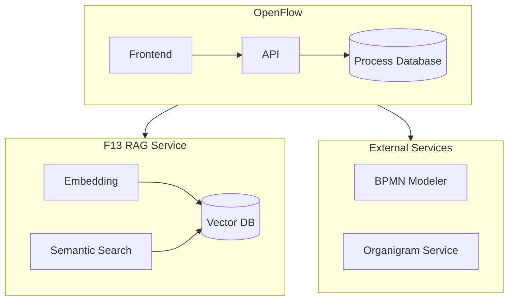
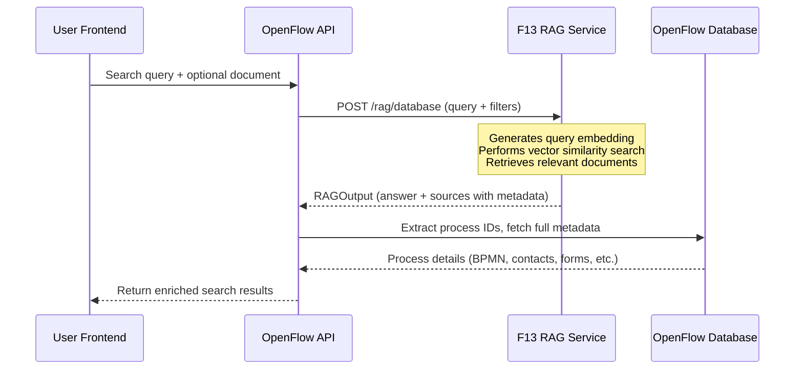

---
# try also 'default' to start simple
theme: default
# random image from a curated Unsplash collection by Anthony
# like them? see https://unsplash.com/collections/94734566/slidev
# background: https://cover.sli.dev
# some information about your slides (markdown enabled)
title: OpenFlow
info: |
  ## OpenFlow Pitch Presentation
# apply UnoCSS classes to the current slide
class: text-center
# basically the text
fonts:
  sans: -apple-system, BlinkMacSystemFont, "Segoe UI", Helvetica, Arial
  local: -apple-system, BlinkMacSystemFont, "Segoe UI", Helvetica, Arial
  code: SFMono-Regular, Consolas, "Liberation Mono", Menlo, Courier
# https://sli.dev/features/drawing
drawings:
  persist: false
# slide transition: https://sli.dev/guide/animations.html#slide-transitions
transition: fade-out
# enable MDC Syntax: https://sli.dev/features/mdc
mdc: true
# duration of the presentation
duration: 10min
---

# OpenFlow

AI-powered search for government process discovery

  <carbon:arrow-right />

  <button @click="$slidev.nav.openInEditor()" title="Open in Editor" class="slidev-icon-btn">
    <carbon:edit />
  </button>
  <a href="https://github.com/vensas/govtech-hackathon-2025-openflow" target="_blank" class="slidev-icon-btn">
    <carbon:logo-github />
  </a>

---

# GOVTECH HACKATHON

**11. & 12. October 2025**

**East Side Fab** 
Saarbrücken

<svg width="200" viewBox="0 0 26.05 14.31" xmlns="http://www.w3.org/2000/svg" class="inline-block">
  
  <g>
    <g>
      <g>
        <path class="cls-1" d="M8.62,4.17c0,.49-.13.87-.38,1.16s-.59.42-1.01.42-.76-.14-1.01-.42c-.25-.28-.37-.67-.37-1.16s.13-.87.37-1.16c.25-.28.59-.42,1.01-.42s.76.14,1.01.42.38.67.38,1.16ZM8.1,4.17c0-.39-.08-.68-.23-.87s-.36-.28-.63-.28-.49.09-.64.28c-.15.19-.23.48-.23.87s.08.66.23.85.36.29.64.29.48-.1.63-.29c.15-.19.23-.48.23-.86Z"/>
        <path class="cls-1" d="M11.95,2.67l-1.21,3h-.51l-1.2-3h.55l.93,2.38.92-2.38h.53Z"/>
        <path class="cls-1" d="M14.16,5.64c-.09.03-.2.05-.31.06s-.21.02-.3.02c-.31,0-.54-.08-.7-.25s-.24-.43-.24-.79v-1.59h-.34v-.42h.34v-.86h.5v.86h1.04v.42h-1.04v1.36c0,.16,0,.28.01.37s.03.17.08.25c.04.07.09.12.16.16s.17.05.32.05c.08,0,.17-.01.26-.04s.15-.04.19-.06h.03v.45Z"/>
        <path class="cls-1" d="M17.28,4.22h-2.21c0,.18.03.34.08.48s.13.25.23.34c.09.09.2.15.33.19.13.04.27.06.42.06.2,0,.41-.04.62-.12.21-.08.35-.16.44-.24h.03v.55c-.17.07-.34.13-.52.18s-.36.07-.56.07c-.5,0-.88-.13-1.16-.4s-.42-.65-.42-1.15.13-.88.4-1.17.62-.43,1.06-.43c.4,0,.72.12.93.35s.33.57.33,1.01v.27ZM16.79,3.83c0-.26-.07-.47-.2-.61-.13-.14-.33-.22-.6-.22s-.49.08-.64.24c-.16.16-.25.36-.27.59h1.72Z"/>
        <path class="cls-1" d="M20.26,5.48c-.17.08-.33.14-.48.19-.15.04-.31.07-.48.07-.22,0-.41-.03-.6-.1s-.34-.16-.46-.29c-.13-.13-.23-.29-.3-.49s-.11-.43-.11-.69c0-.49.13-.87.4-1.15s.62-.42,1.07-.42c.17,0,.34.02.51.07s.32.11.45.18v.56h-.03c-.15-.12-.31-.21-.48-.28-.16-.06-.32-.1-.48-.1-.29,0-.51.1-.68.29-.17.19-.25.47-.25.85s.08.64.24.83c.16.19.39.29.68.29.1,0,.21-.01.31-.04s.2-.06.28-.1c.07-.04.14-.08.21-.12s.12-.08.15-.11h.03v.56Z"/>
        <path class="cls-1" d="M23.41,5.66h-.5v-1.71c0-.14,0-.27-.02-.39s-.05-.21-.09-.28c-.04-.08-.11-.13-.19-.17s-.19-.05-.33-.05-.28.03-.43.1-.29.15-.43.26v2.24h-.5V1.49h.5v1.51c.16-.13.32-.23.49-.31s.34-.11.52-.11c.32,0,.57.1.74.29s.25.48.25.84v1.94Z"/>
      </g>
      <path class="cls-1" d="M26.05,0H2.82c-.88.02-1.48.28-2,.79C.29,1.32.03,2.04.03,2.96c0,.5.07.93.21,1.31s.35.68.61.93c.26.25.58.43.95.55s.78.18,1.22.18h2.1v-2.99h-2.28v.67h1.53v1.67c-.26,0-.43,0-.73,0-.25,0-.36,0-.65,0-.67,0-1.2-.21-1.59-.62s-.58-.99-.58-1.73c0-.7.19-1.26.56-1.67s.89-.61,1.53-.61h22.48v13H.65v-6.2h22.48c.14.26.41.45.73.45.46,0,.84-.38.84-.84s-.38-.84-.84-.84c-.36,0-.66.23-.78.56H0v7.53h26.05V0ZM23.87,6.72c.19,0,.35.16.35.35s-.16.35-.35.35-.35-.16-.35-.35.16-.35.35-.35Z"/>
      <g>
        <path class="cls-1" d="M3.9,11.64l-1.11-.43v-.3l1.11-.49v.29l-.77.34.77.29v.29Z"/>
        <path class="cls-1" d="M5.35,11.64l-1.11-.43v-.3l1.11-.49v.29l-.77.34.77.29v.29Z"/>
        <path class="cls-1" d="M7.01,12.09h-.29v-1.74c0-.22-.11-.33-.32-.33h-.04s-.03,0-.04,0h-.31v2.07h-.29v-3.18h.29s0,.84,0,.84h.44c.38,0,.57.17.57.51v1.84Z"/>
        <path class="cls-1" d="M9.03,12.09h-.16c-.11,0-.19-.05-.27-.15-.11.1-.24.15-.39.15h-.37c-.28,0-.42-.15-.42-.46v-1.33c0-.37.18-.56.54-.56h.81v1.74c0,.21.09.32.26.32v.28ZM8.49,11.51v-1.49h-.53c-.16,0-.24.09-.24.26v1.35c0,.11.06.16.19.16h.23c.24,0,.35-.1.35-.29Z"/>
        <path class="cls-1" d="M10.54,12.09h-.8c-.13,0-.23-.04-.3-.13-.07-.08-.1-.19-.1-.32v-1.44c0-.05.01-.09.02-.12.06-.22.22-.32.51-.32h.68v.28h-.71c-.14,0-.2.07-.2.22v1.39c.02.11.08.17.19.17h.72v.29Z"/>
        <path class="cls-1" d="M12.38,9.75l-.87.88.8,1.47h-.32l-.67-1.27-.12.12v1.15h-.29v-3.19h.29v1.65l.8-.8h.39Z"/>
        <path class="cls-1" d="M14.33,12.09h-.16c-.11,0-.19-.05-.27-.15-.11.1-.24.15-.39.15h-.37c-.28,0-.42-.15-.42-.46v-1.33c0-.37.18-.56.54-.56h.81v1.74c0,.21.09.32.26.32v.28ZM13.79,11.51v-1.49h-.53c-.16,0-.24.09-.24.26v1.35c0,.11.06.16.19.16h.23c.24,0,.35-.1.35-.29Z"/>
        <path class="cls-1" d="M15.67,10.04h-.42v2.06h-.29v-2.06h-.4v-.29h.4v-.84h.29v.84h.42v.29Z"/>
        <path class="cls-1" d="M17.29,12.09h-.29v-1.74c0-.22-.11-.33-.32-.33h-.04s-.03,0-.04,0h-.31v2.07h-.29v-3.18h.29s0,.84,0,.84h.44c.38,0,.57.17.57.51v1.84Z"/>
        <path class="cls-1" d="M19.08,11.41c0,.19-.07.36-.2.5-.13.14-.29.21-.49.21s-.36-.07-.49-.21c-.14-.14-.21-.31-.21-.5v-.96c0-.19.07-.36.2-.5s.3-.21.5-.21.36.07.49.21c.13.14.2.31.2.5v.97ZM18.79,11.36v-.87c0-.12-.03-.23-.1-.32-.07-.1-.17-.15-.28-.15-.1,0-.18.04-.27.11-.1.09-.15.2-.15.35v.87c0,.14.05.26.15.35.08.07.17.11.27.11.12,0,.21-.05.28-.15.07-.09.1-.19.1-.31Z"/>
        <path class="cls-1" d="M20.77,10.27v1.84h-.29v-1.7c0-.12-.02-.21-.07-.26-.03-.03-.09-.06-.2-.08h-.44v2.04h-.29v-2.35h.72c.38,0,.56.17.56.52Z"/>
        <path class="cls-1" d="M22.26,11.21l-1.11.43v-.29l.77-.29-.77-.34v-.29l1.11.49v.3Z"/>
        <path class="cls-1" d="M23.72,11.21l-1.11.43v-.29l.77-.29-.77-.34v-.29l1.11.49v.3Z"/>
      </g>
    </g>
  </g>
</svg>

<carbon:collaborate />Team of 2: <a href="https://www.linkedin.com/in/melanie-s-361150263/">Melanie Schug</a> & <a href="https://www.linkedin.com/in/svenhennessen/">Sven Hennessen</a>

<!--
- GOVTECH Hackathon Saarland 2025
- Team of 2 with Melanie
- F13 Topic Area
-->

---

# F13 AI Platform

**Hackathon: Our Briefing**

- F13 as Saarland's AI platform for government
- F13 offers semantic search capabilities via RAG service
- Government documents are to be embedded in F13's database
- BPMN processes can be generated based on available information

<!--
- F13 provides RAG service and aggregated database
- Government documents are embedded in F13
- BPMN Modeler is planned to generate process diagrams
-->

---

# OpenFlow

**AI-powered government process discovery**

<carbon:warning-alt class="mr-2" /><strong>Assumption</strong>: F13 is used as central platform for government documents and processes. Information available is embedded in F13 and searchable via RAG.

<carbon:share-knowledge class="mr-2" /><strong>Motivation</strong>: Harmonize redundant processes and break up communication silos across government departments.

<!--
- Idea: OpenFlow as central application for process discovery on top of F13
- Assumption: All government documents are embedded in F13 RAG
- Goal: Streamline access to process information and improve collaboration
-->

---
layout: center
class: text-center
---

# Demo

  <a href="http://localhost:3000" target="_blank" class="text-4xl font-bold text-blue-600 hover:text-blue-800 dark:text-blue-400 dark:hover:text-blue-200">
    <carbon:search /> OpenFlow
  </a>

  
<strong>Demo Persona: Sarah, New Employee</strong>

  
"How do I procure software licenses over 25,000 EUR? Do I need a tender process?"

<!--
- Sarah
- New employee in a government department
- Needs to procure software licenses > 25,000 EUR
-->

---

# OpenFlow Features

**What was shown in the demo?**

<ul class="list-none mt-4 space-y-1">
  <li>
    <carbon:search class="mr-2" />
    Natural language search for government processes
  </li>
  <li>
    <carbon:ai-recommend class="mr-2" />
    AI-powered matching via F13 embedding and RAG
  </li>
  <li>
    <carbon:document class="mr-2" />
    Rich process metadata (owner, contact, forms, legal basis)
  </li>
  <li>
    <carbon:flow-connection class="mr-2" />
    BPMN workflow visualization
  </li>
  <li>
    <carbon:warning-alt class="mr-2" />
    Evidence snippets for transparency
  </li>
  <li>
    <carbon:partnership class="mr-2" />
    Integration with external services
  </li>
</ul>

<!--
OpenFlow provides matching processes with BPMN visualization, contacts, and evidence

- Evidence for validation and transparency
- Contact information for collaboration
- Integration of external services (BPMN Modeler, Organigram) 
-->

---

# Thank You!

**Questions?**

<a href="https://github.com/vensas/govtech-hackathon-2025-openflow" target="_blank">
  <carbon:logo-github />
  OpenFlow Demo @ GitHub
</a>

Melanie Schug 
**Ministerium für Wirtschaft, Innovation, Digitales und Energie des Saarlandes** 

  <carbon:email class="mr-2"/><a href="mailto:m.schug@wirtschaft.saarland.de">m.schug@wirtschaft.saarland.de</a> 

 

Sven Hennessen 
**vensas GmbH** 

  <carbon:email class="mr-2"/><a href="mailto:sven.hennessen@vensas.de">sven.hennessen@vensas.de</a> 
  <carbon:phone class="mr-2"/><a href="tel:+4968130984780">+49 (0)681 30984780</a> 
  <carbon:location class="mr-2"/>Halbergstraße 4 - 66121 Saarbrücken 

 

---

# Appendix: OpenFlow Integration 1/2

**High-Level Architecture**

<!--
Optional!

High-level OpenFlow integration architecture
-->

---

# Appendix: OpenFlow Integration 2/2

**Search Integration Flow**

<!--
Optional!

Detailed sequence diagram of OpenFlow search integration with F13 RAG
-->
